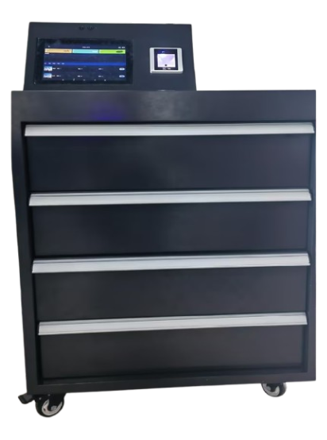
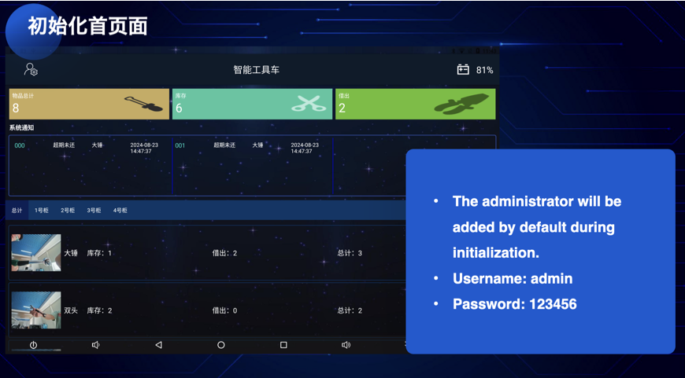
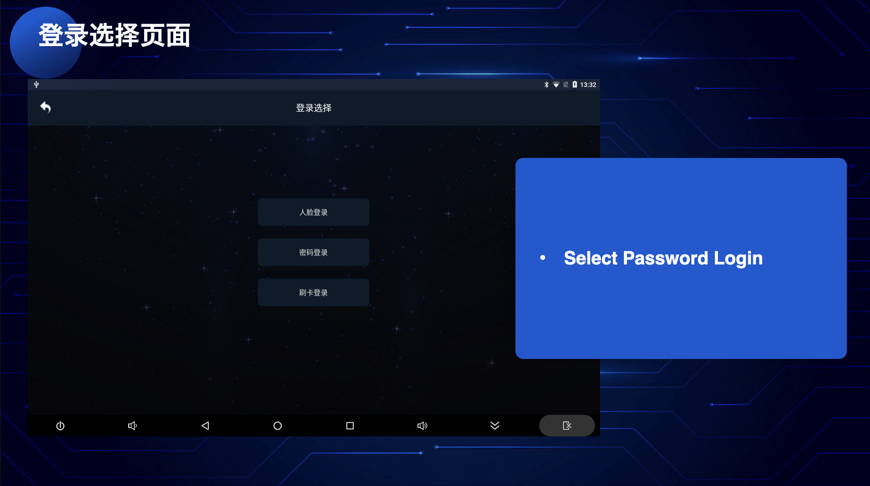
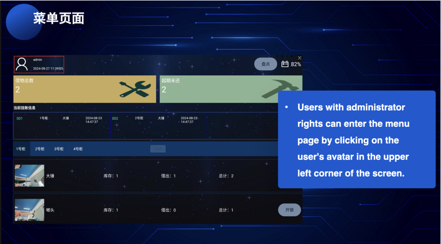
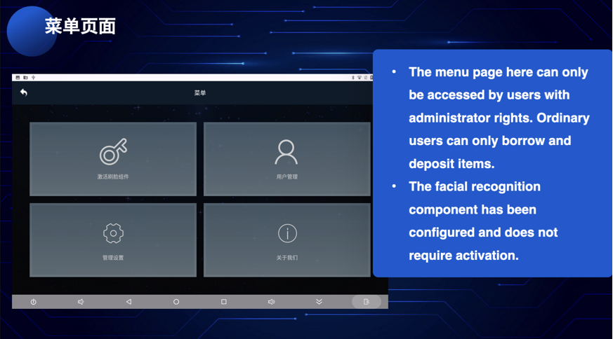

# RFID-Smart-Tool-Cart
The smart tool cart is an efficient management device that uses RFID technology to quickly inventory, lend and return tools automatically. It automatically manages tools stored with RFID tags through software, greatly improving the accuracy and efficiency of tool management, effectively preventing and reducing the loss and theft of tools, simplifying the registration process of tools, and avoiding errors caused by missing inventory or negligent management loss.

### Software
- Android Studio
- Java 17
- Gradle 7.2.1
- SQLite
- Arcface Pro SDK 4.1

### Hardware
- RS232 Serial Port
- RFID Reader
- RFID Tag
- RS232 Smart Locker
- Android Tablet Engineering Machine
- 12V Power Supply
- Battery Meter
- IC Card Reader

### Features
- The smart tool cart can automatically record the lending and return of tools, reducing manual operations and reducing error rates.
- Equipped with one-key point function, it can complete the inventory of tools in a very short time.
- The system can record tool parameter data, provide tool calibration cycle reminders, and help scientifically manage tools.
- When tools are not returned in time, the system will issue a warning and quickly lock down the responsibility of the relevant personnel.
- Smart tool carts usually have built-in rechargeable batteries, which are easy to carry and move. They can work continuously for 10 hours when fully charged.
- Uses a touch LCD screen to display tool details and is easy to operate.
- Administrators and ordinary users can be set up. Administrators can log in to the management background through their account and password to maintain tool information and view records. Different borrower permissions can be set for different tools, and dedicated personnel can be set up to borrow and return high-risk or high-value tools.
- The size of the smart car floor opening can be customized to a variety of specifications. The administrator can bind tools to the door at will in the background, and each tool can be stored in a dedicated layer.

### Installation
- Download the project files and unzip them.
- Open the project in Android Studio.
- Connect the hardware components to the Android tablet.
- Configure the serial port settings in the code.
- Run the application on the Android tablet.

### Usage

- Click on the left top button to enter the login page.

- Enter the username and password and click on the login button.

- After logging in, the main page will be displayed. Here you can view the list of tools, lend tools, return tools.
- Users with administrator rights can enter the menu page by clicking on the user's avatar in the upper left corner of the screen.

- On the menu page, you can manage users, manage tools, and view records.